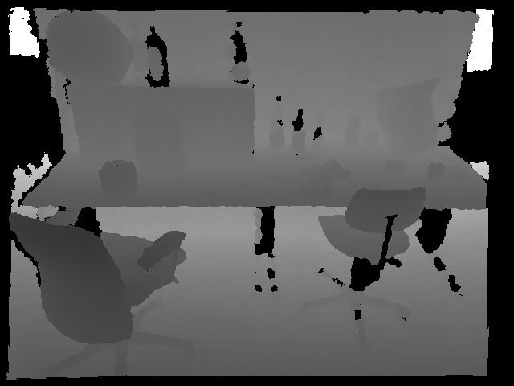
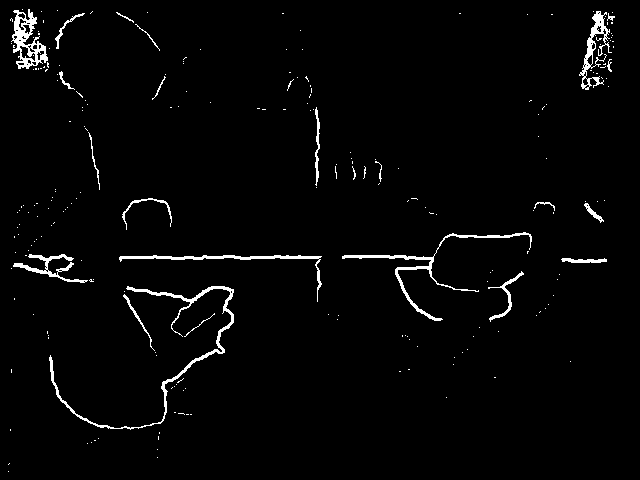
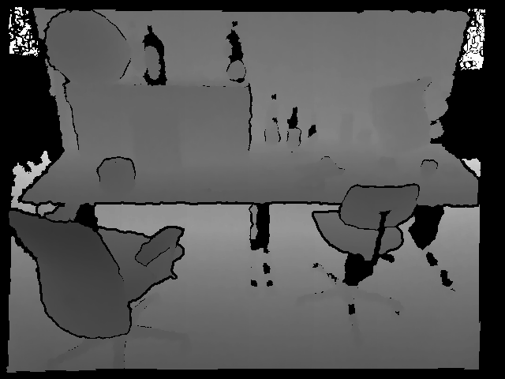

This is a port of PCL's [StatisticalOutlierRemoval](http://pointclouds.org/documentation/tutorials/statistical_outlier.php) to cv::Mat depth image or cv::Mat3f organized point cloud.
Instead of original kNN search in 3D space, use proximity in 2D image space for efficient computation.

Here is a result on a depth frame of rgbd_dataset_freiburg3_long_office_household sequence from [TUM RGB-D SLAM Dataset and Benchmark](https://vision.in.tum.de/data/datasets/rgbd-dataset)
|original|outlier mask|outlier removed|
|---|---|---|
||||

